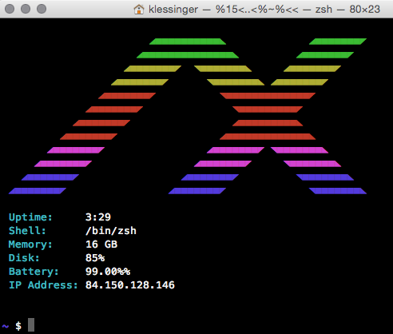

# Shell With AX Archey Logo



Install archey, here is the source:


```
echo -e "
 ${GREEN#  }                      ◢■■■■■■■■■■◣             ◢■■■■■■■◤  
 ${GREEN#  }                    ◢■■■■■■■■■■■■■■◣         ◢■■■■■■■◤
 ${YELLOW# }                  ◢■■■■■■■◤  ◥■■■■■■■◣     ◢■■■■■■■◤
 ${YELLOW# }                ◢■■■■■■■◤      ◥■■■■■■■◣ ◢■■■■■■■◤
 ${RED#    }              ◢■■■■■■■◤          ◥■■■■■■■■■■■■■◤
 ${RED#    }            ◢■■■■■■■◤              ◥■■■■■■■■■◤
 ${RED#    }          ◢■■■■■■■◤                ◢■■■■■■■■■◣
 ${RED#    }        ◢■■■■■■■◤                ◢■■■■■■■■■■■■■◣
 ${PURPLE# }      ◢■■■■■■■◤                ◢■■■■■■■◤ ◥■■■■■■■◣
 ${PURPLE# }    ◢■■■■■■■◤                ◢■■■■■■■◤     ◥■■■■■■■◣
 ${BLUE#   }  ◢■■■■■■■◤                ◢■■■■■■■◤         ◥■■■■■■■◣
 ${BLUE#   }◢■■■■■■■◤                ◢■■■■■■■◤             ◥■■■■■■■◣
${normal}
 ${fieldlist[4]}
 ${fieldlist[5]}
 ${fieldlist[8]}
 ${fieldlist[9]}
 ${fieldlist[10]}
 ${fieldlist[11]}
 ${fieldlist[12]}
 "
 fi
```
